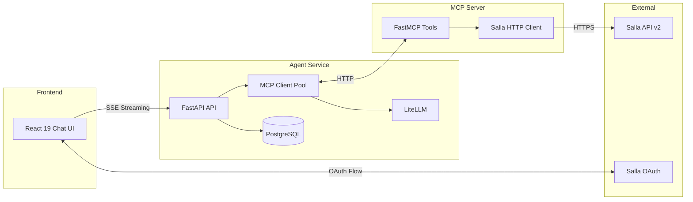

# Salla AI Agent

**Virtual Store Manager for Salla E-commerce Merchants**

Salla AI Agent is an intelligent, conversational assistant designed to help Salla merchants manage their stores through natural language. Acting as a "virtual manager," it enables merchants to query store data, manage products, process orders, and handle customer insights securely via a chat interface.

This project leverages the **Model Context Protocol (MCP)** to standardize AI tool integration and implements a robust **microservices architecture** designed for production resilience.

---

## 🚀 Key Features

- **🗣️ Natural Language Store Management**: Interact with your store using plain language (e.g., *"Show me pending orders from yesterday"*, *"Update the price of iPhone 15 to 3500 SAR"*).
- **📦 Comprehensive Product Operations**: View, search, create, and update products (inventory, pricing, status) on the fly.
- **🛍️ Order Processing**: Retrieve order details, filter by status, manage shipping, and update order stages.
- **👥 Customer Insights**: Deep dive into customer profiles, order history, and behavior.
- **🛡️ Secure Multi-Tenancy**: Built with a custom **MCP Connection Pool** that manages isolated, per-user OAuth tokens, ensuring strict data privacy between merchants.
- **🔄 Resilience & Fault Tolerance**: Features a **"Degraded Mode"** that allows the agent service to remain operational even if the MCP integration server is temporarily unreachable.
- **🔒 Production-Grade Storage**: Migrated from SQLite to **PostgreSQL** for robust, scalable data persistence.
 
---

## 🛠️ Technology Stack

The project fits into a modern, full-stack ecosystem:

| Category | Technology |
| :--- | :--- |
| **Frontend** | **React 19**, **Vite 7**, **TailwindCSS 4**, React Router 7 |
| **Backend** | **Python**, **FastAPI** (Async Web Framework) |
| **AI Integration** | **LiteLLM** (Model-agnostic), **Model Context Protocol (MCP)** |
| **Database** | **PostgreSQL 16**, SQLAlchemy (Async ORM), Alembic (Migrations) |
| **Infrastructure** | **Docker**, **Docker Compose** |

---

## 🏗️ Architecture Overview



### Key Design Patterns

1.  **Microservices Architecture**: Separate services for the Agent (Brain), MCP Server (Tools), and Frontend (UI) for independent scaling.
2.  **Custom Connection Pooling**: Solves the "multi-tenant state" problem by managing a pool of isolated MCP connections, each injected with a specific user's OAuth token.
3.  **Resilient Lifespan Management**: Services start gracefully and handle dependency failures without crashing.

---

## 📁 Project Structure

```
salla-agent/
├── agent/                      # Backend AI Agent Service
│   ├── src/agent/
│   │   ├── main.py             # FastAPI entry point
│   │   ├── api/routes/         # API endpoints
│   │   ├── services/           # Business logic (MCP client, pooling, auth)
│   │   ├── repositories/       # Database access layer
│   │   └── core/               # Configuration & settings
│   ├── Dockerfile
│   └── alembic/                # Database migrations
│
├── mcp-server/                 # Salla MCP Server (Integration Layer)
│   ├── src/mcp_server/
│   │   ├── main.py             # FastMCP server & tool definitions
│   │   └── salla_client.py     # Async HTTP client for Salla
│   └── Dockerfile
│
├── frontend/                   # React 19 Frontend
│   ├── src/                    # Components, Hooks, Contexts
│   ├── Dockerfile
│   └── nginx.conf              # Production server config
│
└── docker-compose.yml          # Orchestration for all services + DB
```

---

## ⚡ Quick Start

The easiest way to run the project is using **Docker Compose**.

### Prerequisites
- Docker & Docker Compose installed on your machine.
- Salla App Credentials (Client ID, Client Secret).

### 1. Setup Environment Variables

Create `.env` files for the services:

**`agent/.env`**
```env
# Database (PostgreSQL is configured in docker-compose)
DATABASE_URL=postgresql+asyncpg://salla_user:salla_password@db:5432/salla_agent

# LLM Configuration
LLM_MODEL=gemini/gemini-3-flash-preview
LLM_TEMPERATURE=1
GEMINI_API_KEY=your_gemini_key

# Salla OAuth
SALLA_CLIENT_ID=your_client_id
SALLA_CLIENT_SECRET=your_client_secret
SALLA_REDIRECT_URI=http://localhost:3000/callback

# Security
SECRET_KEY=generate_a_secure_random_key
```

**`mcp-server/.env`**
```env
# Optional: Default Salla API Config
SALLA_API_BASE_URL=https://api.salla.dev/admin/v2
```

### 2. Start Services

```bash
# Build and start all containers in the background
docker-compose up -d --build
```

This will start:
- **Frontend** at `http://localhost:3000`
- **Agent API** at `http://localhost:8000`
- **MCP Server** (Internal)
- **PostgreSQL Database** (Internal port 5432, exposed on host 5432)

### 3. Access the Application
Open your browser and navigate to **[http://localhost:3000](http://localhost:3000)**. Click "Login with Salla" to authenticate and start chatting with your store manager.

---

## 🔧 Local Development

If you prefer running services locally without Docker (e.g., for debugging):

1.  **Start PostgreSQL**: Ensure you have a Postgres instance running and update `DATABASE_URL` in `agent/.env` to point to it (e.g., `localhost`).
2.  **Start MCP Server**:
    ```bash
    cd mcp-server
    uv sync
    uv run python -m mcp_server.main --transport http
    ```
3.  **Start Agent Service**:
    ```bash
    cd agent
    uv sync
    uv run alembic upgrade head  # Run DB migrations
    uv run python -m agent.main
    ```
4.  **Start Frontend**:
    ```bash
    cd frontend
    npm install
    npm run dev
    ```

---

