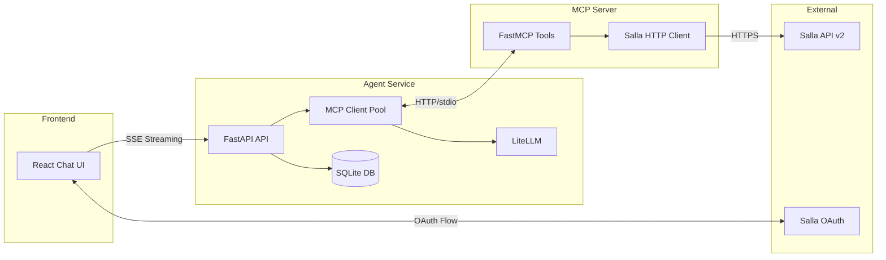
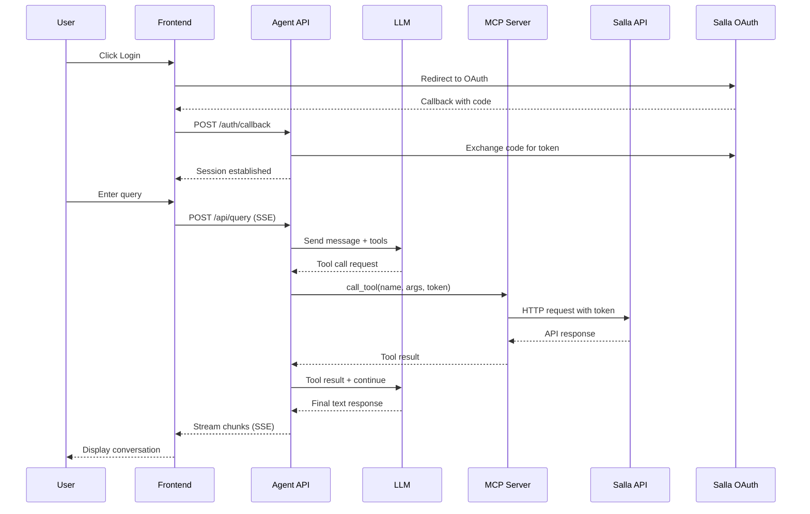

# Salla AI Agent

AI-powered assistant for Salla e-commerce platform merchants, enabling natural language management of stores, products, orders, and customers through OAuth-secured conversations.

## Architecture Overview



## Project Structure

```
salla-agent/
├── agent/                      # Backend AI Agent Service
│   ├── src/agent/
│   │   ├── main.py             # FastAPI application entry
│   │   ├── api/
│   │   │   └── routes/         # API endpoints (auth, query, conversation, health)
│   │   ├── core/
│   │   │   └── config.py       # Pydantic settings
│   │   ├── services/
│   │   │   ├── mcp_client.py   # MCP client with LLM integration
│   │   │   ├── client_pool.py  # Connection pooling for MCP
│   │   │   ├── auth_service.py # Salla OAuth handling
│   │   │   └── conversation.py # Conversation management
│   │   ├── repositories/       # Database repositories
│   │   └── migrations/         # Alembic database migrations
│   ├── pyproject.toml
│   ├── Dockerfile
│   └── .env
│
├── mcp-server/                 # Salla MCP Server
│   ├── src/mcp_server/
│   │   ├── main.py             # FastMCP server with 12 tools
│   │   ├── salla_client.py     # Async HTTP client for Salla API
│   │   └── config.py           # Pydantic settings
│   ├── pyproject.toml
│   ├── Dockerfile
│   └── .env
│
├── frontend/                   # React Frontend
│   └── src/
│       ├── App.jsx             # Main application component
│       ├── components/         # UI components
│       ├── hooks/              # React hooks
│       ├── contexts/           # Auth context
│       ├── pages/              # Page components
│       └── services/           # API service layer
│
└── docker-compose.yml          # Multi-service orchestration
```

---

## Service 1: Salla MCP Server

**Location:** `mcp-server/`

The MCP (Model Context Protocol) Server exposes Salla e-commerce operations as callable tools for AI agents. Supports both HTTP and stdio transports.

### Core Components

| File | Purpose |
|------|---------|
| `main.py` | FastMCP server with 12 tool definitions |
| `salla_client.py` | Async HTTP client wrapper with retry logic |
| `config.py` | Pydantic settings for API configuration |

### Available Tools (12 total)

#### Products (4 tools)
| Tool | Description |
|------|-------------|
| `list_products` | List products with pagination/filtering (keyword, status) |
| `get_product` | Get detailed product information by ID |
| `create_product` | Create product (name, price, type, quantity, SKU, description) |
| `update_product` | Update product details (name, price, quantity, status) |

#### Orders (4 tools)
| Tool | Description |
|------|-------------|
| `list_orders` | List orders with pagination/filtering (status, keyword) |
| `get_order` | Get order details including items, customer, shipping |
| `create_order` | Create order (customer_id, products, shipping, payment) |
| `update_order_status` | Update order status with notification option |

#### Customers (3 tools)
| Tool | Description |
|------|-------------|
| `list_customers` | List customers with search by name/email/mobile |
| `get_customer` | Get customer details including addresses and orders |
| `create_customer` | Create customer (name, mobile, email, country) |

#### Store (1 tool)
| Tool | Description |
|------|-------------|
| `get_store_info` | Get store details (name, domain, plan, currency) |

### Configuration

```python
# mcp-server/src/mcp_server/config.py
class Settings(BaseSettings):
    salla_access_token: str = ""          # Passed per-request via Authorization header
    salla_api_base_url: str = "https://api.salla.dev/admin/v2"
    api_timeout: int = 30
    api_max_retries: int = 3
```

### Running the MCP Server

```bash
cd mcp-server
uv sync

# HTTP transport (production)
uv run python -m mcp_server.main --transport http --port 8001

# stdio transport (development)
uv run python -m mcp_server.main --transport stdio
```

---

## Service 2: Backend Agent

**Location:** `agent/`

FastAPI application that orchestrates AI conversations, manages OAuth authentication, and persists conversation history.

### Core Components

| Directory/File | Purpose |
|----------------|---------|
| `main.py` | FastAPI app with lifespan management |
| `api/routes/` | REST endpoints (auth, query, conversation, health) |
| `services/mcp_client.py` | MCPClient with streaming LLM integration |
| `services/client_pool.py` | Connection pooling for MCP clients |
| `services/auth_service.py` | Salla OAuth2 flow handling |
| `repositories/` | SQLAlchemy repositories for DB operations |
| `migrations/` | Alembic database migrations |

### API Endpoints

| Method | Endpoint | Description |
|--------|----------|-------------|
| POST | `/api/query` | Stream user query and return AI response (SSE) |
| GET | `/api/conversations` | List user's conversations |
| GET | `/api/conversations/{id}` | Get conversation messages |
| DELETE | `/api/conversations/{id}` | Delete a conversation |
| GET | `/auth/login` | Initiate Salla OAuth flow |
| GET | `/auth/callback` | Handle OAuth callback |
| GET | `/health` | Service health check |

### MCPClient Class

```python
class MCPClient:
    """Manages MCP server connection and LLM orchestration."""
    
    async def connect_to_server(transport_type: str, server_url: str)
        # Connects via HTTP or stdio transport
        # Retrieves and caches available tools
    
    async def process_query_stream(query: str, access_token: str) -> AsyncGenerator
        # 1. Sends query to LLM with system prompt and tools
        # 2. Streams response chunks via SSE
        # 3. Executes tool calls with user's Salla token
        # 4. Continues until final text response
    
    async def call_llm(messages: list, tools: list, stream: bool)
        # Uses LiteLLM for model-agnostic LLM calls
        # Supports Gemini, OpenAI, Anthropic, etc.
```

### Configuration

```python
# agent/src/agent/core/config.py
class Settings(BaseSettings):
    # Database
    database_url: str                      # SQLite connection string
    
    # LLM Configuration
    llm_model: str = "gemini/gemini-3-flash-preview"
    llm_temperature: float = 1
    llm_max_retries: int = 1
    llm_max_tokens: int = 4096
    
    # MCP Configuration
    mcp_transport: str = "http"            # 'stdio' or 'http'
    mcp_server_url: str = "http://localhost:8001/mcp"
    
    # API Server
    api_host: str = "0.0.0.0"
    api_port: int = 8000
    
    # Agent Limits
    max_iterations: int = 10               # Max tool-calling iterations
    max_query_length: int = 10000
    tool_timeout: float = 30.0
    
    # Rate Limiting
    rate_limit_enabled: bool = True
    rate_limit_requests: int = 60          # Per window
    rate_limit_window: int = 60            # Seconds
    
    # Salla OAuth
    salla_client_id: str
    salla_client_secret: str
    salla_redirect_uri: str
    salla_oauth_base_url: str = "https://accounts.salla.sa/oauth2"
```

### Running the Agent

```bash
cd agent
uv sync

# Apply database migrations
uv run alembic upgrade head

# Start the server
uv run python -m agent.main
```

Starts the FastAPI server on `http://localhost:8000` with automatic MCP connection.

---

## Service 3: Frontend

**Location:** `frontend/`

React-based chat interface with Salla OAuth integration and real-time streaming responses.

### Core Components

| Component | Purpose |
|-----------|---------|
| `App.jsx` | Main layout with routing and auth protection |
| `components/` | Sidebar, ChatContainer, Message components |
| `hooks/useChat.js` | Chat state management and SSE streaming |
| `contexts/AuthContext.jsx` | Authentication state and token management |
| `services/api.js` | HTTP client for backend communication |

### Features

- **OAuth Authentication**: Seamless Salla merchant login
- **SSE Streaming**: Real-time response streaming
- **Conversation History**: Persistent chat sessions
- **Tool Call Display**: Expandable tool execution details
- **Responsive Design**: Mobile-friendly interface

### Running the Frontend

```bash
cd frontend
npm install
npm run dev
```

Opens at `http://localhost:5173`

---

## Data Flow

### OAuth + Query Processing Sequence



### Message Types

| Role | Description |
|------|-------------|
| `system` | Initial system prompt (not shown in UI) |
| `user` | User's input query |
| `assistant` | LLM response or tool call request |
| `tool` | Result from MCP tool execution |

---

## Dependencies

### Agent Service (agent/pyproject.toml)

```
fastapi>=0.128.0      # Web framework
litellm>=1.80.17      # Multi-provider LLM client
mcp>=1.25.0           # Model Context Protocol SDK
httpx>=0.28.1         # Async HTTP client
sqlalchemy>=2.0.45    # ORM for database
alembic>=1.18.1       # Database migrations
pydantic>=2.12.5      # Data validation
uvicorn>=0.30.0       # ASGI server
```

### MCP Server (mcp-server/pyproject.toml)

```
mcp>=1.25.0           # Model Context Protocol SDK
httpx>=0.28.1         # Async HTTP client
pydantic>=2.12.5      # Data validation
uvicorn>=0.30.0       # ASGI server (for HTTP transport)
```

### Frontend

- React 18
- Vite (build tool)

---

## Environment Variables

### Agent Service (.env)

```env
# Database
DATABASE_URL=sqlite+aiosqlite:///./salla_agent.db

# LLM Configuration
LLM_MODEL=gemini/gemini-3-flash-preview
LLM_TEMPERATURE=1
GEMINI_API_KEY=your_key_here

# MCP Configuration
MCP_TRANSPORT=http
MCP_SERVER_URL=http://localhost:8001/mcp

# Salla OAuth
SALLA_CLIENT_ID=your_client_id
SALLA_CLIENT_SECRET=your_client_secret
SALLA_REDIRECT_URI=http://localhost:5173/callback
```

### MCP Server (.env)

```env
# Salla API (optional - tokens passed per-request)
SALLA_API_BASE_URL=https://api.salla.dev/admin/v2
API_TIMEOUT=30
API_MAX_RETRIES=3
```

---

## Quick Start

### Using Docker Compose

```bash
# 1. Set up environment files
cp agent/.env.example agent/.env
cp mcp-server/.env.example mcp-server/.env
# Edit .env files with your credentials

# 2. Start all services
docker-compose up -d

# 3. Open http://localhost:3000
```

### Local Development

```bash
# 1. Start MCP Server
cd mcp-server
uv sync
uv run python -m mcp_server.main --transport http --port 8001

# 2. Start Agent (new terminal)
cd agent
uv sync
uv run alembic upgrade head
uv run python -m agent.main

# 3. Start Frontend (new terminal)
cd frontend
npm install
npm run dev

# 4. Open http://localhost:5173 and login with Salla
```

---

## Key Design Decisions

1. **Multi-Service Architecture**: Separate services for agent, MCP server, and frontend for independent scaling and deployment
2. **HTTP MCP Transport**: Uses HTTP transport in production for better containerization; stdio available for development
3. **Per-Request Token Passing**: User's Salla token is passed per-request to MCP server, ensuring secure multi-tenant operation
4. **Connection Pooling**: MCPClientPool manages persistent connections with per-user token injection
5. **SSE Streaming**: Real-time response streaming for better UX
6. **LiteLLM**: Enables swapping LLM providers without code changes
7. **SQLite + Alembic**: Persistent storage for users, conversations, and OAuth tokens with migration support
8. **Rate Limiting**: Built-in request rate limiting for API protection
