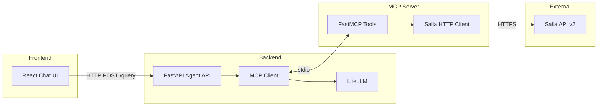
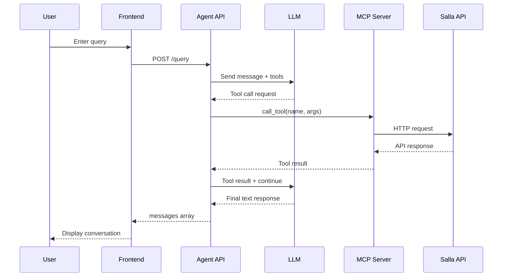

# Salla AI Agent

AI-powered assistant for Salla e-commerce platform merchants, enabling natural language management of stores, products, orders, and customers.

## Architecture Overview



## Project Structure

```
salla-agent/
├── src/
│   ├── agent/              # Backend AI Agent Service
│   │   ├── main.py         # FastAPI application entry point
│   │   ├── mcp_client.py   # MCP client with LLM integration
│   │   ├── prompts.py      # System prompts for the AI
│   │   └── utils/          # Configuration and logging utilities
│   │
│   └── mcp_server/         # Salla MCP Server
│       ├── main.py         # FastMCP server with 20 tools
│       ├── salla_client.py # Async HTTP client for Salla API
│       └── config.py       # Pydantic settings
│
├── frontend/               # React Frontend
│   └── src/
│       ├── App.jsx         # Main application component
│       ├── components/     # UI components (Sidebar, ChatContainer)
│       ├── hooks/          # useChat hook for state management
│       └── services/       # API service layer
│
├── conversations/          # Saved conversation logs (JSON)
├── pyproject.toml          # Python dependencies
└── .env                    # Environment variables
```

---

## Service 1: Salla MCP Server

**Location:** `src/mcp_server/`

The MCP (Model Context Protocol) Server exposes Salla e-commerce operations as callable tools for AI agents.

### Core Components

| File | Purpose |
|------|---------|
| `main.py` | FastMCP server initialization and 20 tool definitions |
| `salla_client.py` | Async HTTP client wrapper for Salla API |
| `config.py` | Pydantic settings for API credentials |

### Available Tools (20 total)

#### Products (4 tools)
| Tool | Description |
|------|-------------|
| `list_products` | List products with pagination and filtering (keyword, status) |
| `get_product` | Get detailed product information by ID |
| `create_product` | Create new product (name, price, type, quantity, SKU) |
| `update_product` | Update product details (name, price, quantity, status) |

#### Orders (4 tools)
| Tool | Description |
|------|-------------|
| `list_orders` | List orders with pagination and filtering |
| `get_order` | Get order details including items, customer, shipping |
| `create_order` | Create new order (customer_id, products, shipping) |
| `update_order_status` | Update order status with customer notification option |

#### Customers (3 tools)
| Tool | Description |
|------|-------------|
| `list_customers` | List customers with search by name/email/mobile |
| `get_customer` | Get customer details including addresses and orders |
| `create_customer` | Create new customer (name, mobile, email, country) |

### Configuration

```python
# src/mcp_server/config.py
class Settings(BaseSettings):
    salla_access_token: str       # Required: Salla API OAuth token
    salla_api_base_url: str = "https://api.salla.dev/admin/v2"
    api_timeout: int = 30
```

### Running the MCP Server

The MCP server is started automatically by the agent via stdio. It can also be run standalone:

```bash
python -m src.mcp_server.main
```

---

## Service 2: Backend Agent AI

**Location:** `src/agent/`

The Backend Agent is a FastAPI application that connects the frontend to the MCP server, orchestrating AI conversations with tool calling capabilities.

### Core Components

| File | Purpose |
|------|---------|
| `main.py` | FastAPI app with `/query` and `/tools` endpoints |
| `mcp_client.py` | MCPClient class managing LLM and tool execution |
| `prompts.py` | System prompt defining AI assistant behavior |
| `utils/` | Settings and logging configuration |

### API Endpoints

| Method | Endpoint | Description |
|--------|----------|-------------|
| POST | `/query` | Process user query and return conversation messages |
| GET | `/tools` | List available MCP tools |

### MCPClient Class

```python
class MCPClient:
    """Manages MCP server connection and LLM orchestration."""
    
    async def connect_to_server(server_script_path: str)
        # Connects to MCP server via stdio
        # Retrieves and caches available tools
    
    async def process_query(query: str) -> list[dict]
        # 1. Sends query to LLM with system prompt
        # 2. Executes tool calls via MCP session
        # 3. Continues until LLM returns final text response
        # 4. Logs conversation to JSON file
    
    async def call_llm() -> LLMResponse
        # Uses LiteLLM for model-agnostic LLM calls
        # Supports OpenAI, Anthropic, and other providers
```

### System Prompt

The agent is configured to:
- Only answer Salla-related questions
- Help with products, orders, customers, inventory
- Decline non-Salla topics politely

### Configuration

```python
# src/agent/utils/config.py
class Settings(BaseSettings):
    llm_model: str              # e.g., "gpt-4", "claude-3-sonnet"
    llm_temperature: float = 0.7
    server_script_path: str     # Path to MCP server main.py
    api_host: str = "0.0.0.0"
    api_port: int = 8000
```

### Running the Agent

```bash
python -m src.agent.main
```

This starts the FastAPI server on `http://localhost:8000` with automatic MCP server connection.

---

## Service 3: Frontend

**Location:** `frontend/`

A React-based chat interface built with Vite for real-time interaction with the Salla AI Agent.

### Core Components

| Component | Purpose |
|-----------|---------|
| `App.jsx` | Main layout with Sidebar and ChatContainer |
| `Sidebar.jsx` | Navigation with "New Chat" action |
| `ChatContainer.jsx` | Message display and input handling |
| `useChat.js` | State management hook for messages |
| `api.js` | HTTP client for backend communication |

### API Integration

```javascript
// src/services/api.js
const API_BASE_URL = 'http://localhost:8000';

export async function sendQuery(query) {
    // POST /query with { query: string }
    // Returns { messages: Array }
}

export async function getTools() {
    // GET /tools
    // Returns { tools: Array }
}
```

### useChat Hook

```javascript
// Manages chat state and API communication
const { messages, isLoading, error, sendMessage, clearMessages } = useChat();

// Message structure:
{
    id: number,
    role: 'user' | 'assistant' | 'tool',
    content: string,
    toolCalls?: Array,      // For assistant messages with tool calls
    toolCallId?: string,    // For tool response messages
    timestamp: string
}
```

### Running the Frontend

```bash
cd frontend
npm install
npm run dev
```

Opens at `http://localhost:5173`

---

## Data Flow

### Query Processing Sequence



### Message Types

| Role | Description |
|------|-------------|
| `system` | Initial system prompt (not shown in UI) |
| `user` | User's input query |
| `assistant` | LLM response or tool call request |
| `tool` | Result from MCP tool execution |

---

## Dependencies

### Python (pyproject.toml)

```
fastapi>=0.128.0      # Web framework
litellm>=1.80.17      # Multi-provider LLM client
mcp>=1.25.0           # Model Context Protocol SDK
httpx>=0.28.1         # Async HTTP client
pydantic>=2.12.5      # Data validation
```

### Frontend (package.json)

- React 18
- Vite (build tool)
- ESLint (linting)

---

## Environment Variables

Create `.env` in project root:

```env
# Salla API
SALLA_ACCESS_TOKEN=your_token_here

# LLM Configuration
LLM_MODEL=gpt-4
LLM_TEMPERATURE=0.7
OPENAI_API_KEY=your_key_here   # or other provider keys
```

---

## Quick Start

```bash
# 1. Install Python dependencies
uv sync

# 2. Set environment variables
cp .env.example .env
# Edit .env with your credentials

# 3. Start the backend agent
python -m src.agent.main

# 4. In another terminal, start frontend
cd frontend && npm install && npm run dev

# 5. Open http://localhost:5173
```

---

## Key Design Decisions

1. **MCP Protocol**: Uses stdio communication for process isolation and reliability
2. **LiteLLM**: Enables swapping LLM providers without code changes
3. **Async HTTP**: All Salla API calls are async for performance
4. **Conversation Logging**: Each query creates a new JSON log file for debugging
5. **Type Safety**: Pydantic models throughout for validation
